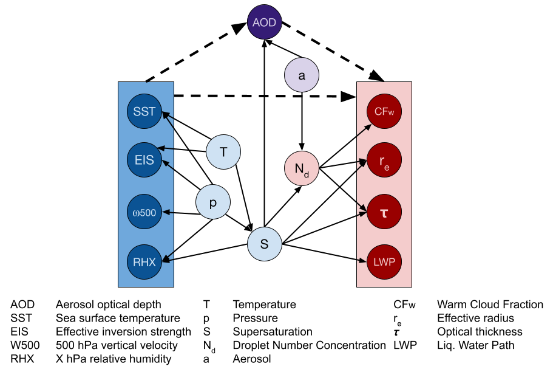
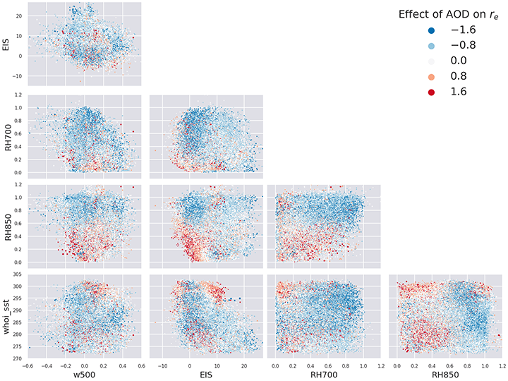
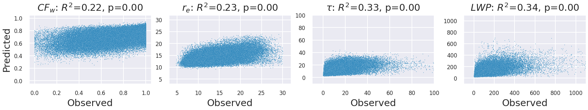

# clouds



Code to reproduce the results presented in [Using Non-Linear Causal Models to Study Aerosol-Cloud Interactions in the Southeast Pacific](https://arxiv.org/abs/2110.15084).

```bibtex
@article{jesson2021using,
  title={Using Non-Linear Causal Models to Study Aerosol-Cloud Interactions in the Southeast Pacific},
  author={Jesson, Andrew and Manshausen, Peter and Douglas, Alyson and Watson-Parris, Duncan and Gal, Yarin and Stier, Philip},
  journal={arXiv preprint arXiv:2110.15084},
  year={2021}
}
```

## Abstract

Aerosol-cloud interactions include a myriad of effects that all begin when aerosol enters a cloud and acts as cloud condensation nuclei (CCN). An increase in CCN results in a decrease in the mean cloud droplet size ($r_e$). The smaller droplet size leads to brighter, more expansive, and longer lasting clouds that reflect more incoming sunlight, thus cooling the earth. Globally, aerosol-cloud interactions cool the Earth, however the strength of the effect is heterogeneous over different meteorological regimes. Understanding how aerosol-cloud interactions evolve as a function of the local environment can help us better understand sources of error in our Earth system models, which currently fail to reproduce the observed relationships. In this work we use recent non-linear, causal machine learning methods to study the heterogeneous effects of aerosols on cloud droplet radius.

## Installation

```.sh
git clone git@github.com:anndvision/clouds.git
cd clouds
conda env create -f environment.yml
conda activate clouds
```

[Optional] Developer mode

```.sh
pip install -e .
```

## Download Data

Make a directory to store the data and download the dataset to that directory.

```.sh
mkdir data
wget -P data/ "https://github.com/anndvision/data/raw/main/jasmin/four_outputs_liqcf_pacific.csv"
```

## Quince Model

### Train model

First we will need to train a model. This can be done using the following command:

```.sh
clouds train --job-dir output/ --gpu-per-model 0.25 jasmin --root data/four_outputs_liqcf_pacific.csv ensemble
```

In this example we write to the directory `output/`, which will be created wherever you run the above command. The model parameters will be saved in this directory. You can change the job-dir directory to anywhere you would rather write files to.

### Make predictions

Now we load the trained model and predict the CATE with it.

```.sh
clouds predict --job-dir output/ --gpu-per-model 0.25 jasmin --root data/four_outputs_liqcf_pacific.csv ensemble
```

This command will write 3 csv files. One corresponding to the train, valid, and test sets:

`output/jasmin/ensemble/dh-800_nc-20_dp-3_ns-0.0_dr-0.5_sn-0.0_lr-0.0002_bs-4096_ep-400/results_train.csv`

`output/jasmin/ensemble/dh-800_nc-20_dp-3_ns-0.0_dr-0.5_sn-0.0_lr-0.0002_bs-4096_ep-400/results_valid.csv`

`output/jasmin/ensemble/dh-800_nc-20_dp-3_ns-0.0_dr-0.5_sn-0.0_lr-0.0002_bs-4096_ep-400/results_test.csv`

### Plot results

Now we plot the results:

Training set

```.sh
clouds plot --csv-path output/jasmin/ensemble/dh-800_nc-20_dp-3_ns-0.0_dr-0.5_sn-0.0_lr-0.0002_bs-4096_ep-400/results_train.csv --output-dir output/ensemble/train/
```

Validation set

```.sh
clouds plot --csv-path output/jasmin/ensemble/dh-800_nc-20_dp-3_ns-0.0_dr-0.5_sn-0.0_lr-0.0002_bs-4096_ep-400/results_valid.csv --output-dir output/ensemble/valid/
```

Test set

```.sh
clouds plot --csv-path output/jasmin/ensemble/dh-800_nc-20_dp-3_ns-0.0_dr-0.5_sn-0.0_lr-0.0002_bs-4096_ep-400/results_test.csv --output-dir output/ensemble/test/
```

You can now look in the folder `output/ensemble` and see the results.





### Hyperparameter Tuning

The above examples use the hyper-paramters determined by the following command:

```.sh
clouds tune --job-dir output/ --gpu-per-model 0.2 jasmin --root data/four_outputs_liqcf_pacific.csv ensemble
```

## Causal Forest and Bayesian Linear Regression

Notebooks to run the Causal Forest and Bayesian Linear Regression models:

*Causal Forest* `examples/CausalForests.ipynb`

*Bayesian Linear Regression* `examples/BLR.ipynb`
